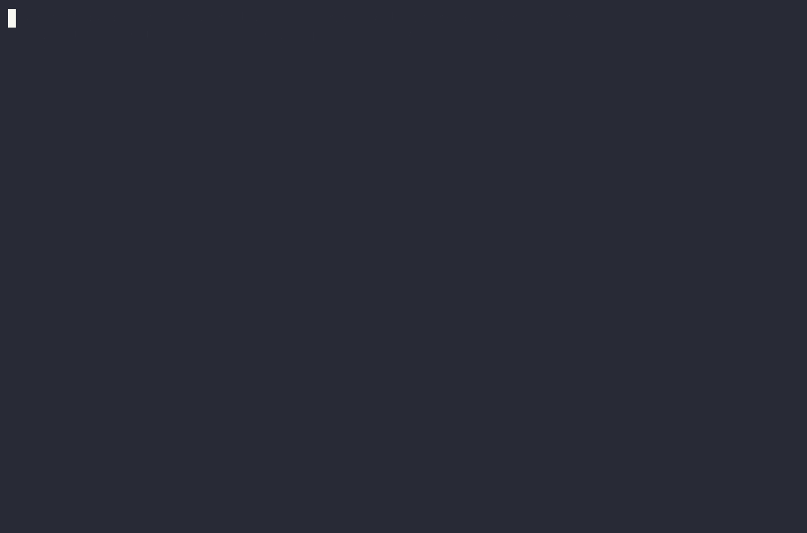
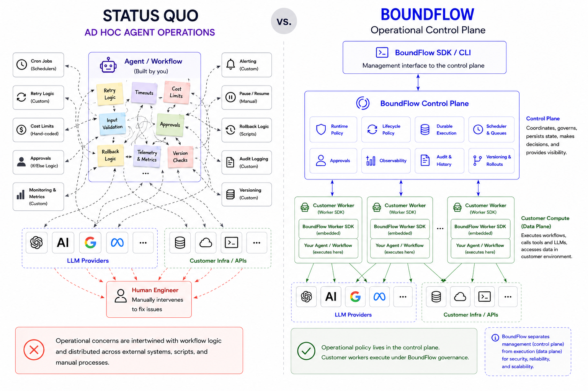

# BoundFlow

**BoundFlow is the open source control plane for running production AI agents and workflows safely, at scale.**


> [!IMPORTANT]
> **Public preview (pre-1.0).** The engine is complete and covered by Go, mock-LLM,
> and live-LLM test suites, but it hasn't yet been run in production with external
> users. APIs — including the gRPC protobufs — may change before 1.0. We're looking
> for early adopters and design partners: [reach out](mailto:hello@boundflow.dev).

Agents and workflows are written against a Python SDK and run on workers in the
operator's environment, using the operator's own inference keys. BoundFlow's control
plane schedules, governs, and audits every run. This separates management (the
control plane) from execution (the data plane): the backend never sees inference keys
or traffic, and never pays for tokens. Governance spans the entire workflow —
scheduling each run, carrying state across steps, and recovering from failures — not
just the individual model call.

## What BoundFlow does

Running agents in production means addressing three operational concerns. BoundFlow
provides a primitive for each:

- **Runtime Governance as Policy** — constrain a run while it executes: per-run cost
  caps, tool-call limits, token and latency ceilings, and model selection. Enforced in
  the worker, mid-run.
- **Operational Lifecycle Management as Policy** — a workflow reacts to its own cost,
  failure, and approval-rejection signals over time: switch models, cool down, pause,
  or roll back to a known-good version, without manual intervention.
- **Durable Execution** — runs are checkpointed and leased; if a worker crashes,
  another resumes the run without losing progress.

Below: a periodic workflow running under a lifecycle policy. When its lifetime cost
crosses the configured budget, BoundFlow rolls it back to the last good version
automatically.



BoundFlow is not a prompt framework, an inference provider, or an agent-builder; it
is the operational layer around the agents you build.

- **Backend** — open source (Apache-2.0), self-hostable as a container.
- **Python SDK** — open source (MIT), `pip install boundflow`.
- **Docs** — concepts, governance, deployment, and API reference in [`docs/`](docs/).
- **BoundFlow Cloud** — prefer not to self-host? Managed hosting (early access) — see [below](#hosted-boundflow-cloud).

---

## Architecture

The BoundFlow backend is the control plane; it is self-hosted or run on BoundFlow
Cloud. Workers connect to it over gRPC and run the agents — with the operator's own
inference key, in the operator's environment — while the backend schedules,
dispatches, governs, and audits, and never sees the key or the inference traffic.



Under the hood the backend runs as three process modes (`server`, `scheduler`,
`worker`) off one binary sharing Postgres — see
**[docs/concepts.md](docs/concepts.md)** for the full breakdown and the lifecycle
states.

---

## SDK at a glance

```python
from boundflow import AgentDefinition, BoundFlowWorker, Complete, ControlPlaneClient, WorkflowConfig
from boundflow.anthropic_client import AnthropicLlmClient

worker = BoundFlowWorker(llm=AnthropicLlmClient(...))  # endpoints + key from env

@worker.workflow("triage", version=1)
async def triage(ctx):
    ctx.add_context("ticket", "...")
    await ctx.run_agent(AgentDefinition(
        name="analyst", model="claude-haiku-4-5",
        system_prompt="Diagnose the issue.", output_schema={"summary": {"type": "string"}},
    ))
    return Complete()
```

Any tool-calling LangChain chat model can be wrapped in `LangChainLlmClient`, and
governance is identical — OpenAI, Google, Bedrock, and the rest of LangChain's
ecosystem run under the same cost caps, model policies, and approval gates:

```python
from langchain_anthropic import ChatAnthropic          # or ChatOpenAI, ChatVertexAI, ...
from boundflow.langchain_client import LangChainLlmClient

worker = BoundFlowWorker(llm=LangChainLlmClient(ChatAnthropic(model="claude-haiku-4-5")))
```

Install with `pip install "boundflow[langchain]"`; see
[`boundflow.examples.langchain_adapter`](sdk/python/boundflow/examples/langchain_adapter.py)
for a runnable end-to-end example.

A LangGraph agent graph can be built inside a workflow, with its nodes calling
`ctx.run_agent`: LangGraph owns the routing while BoundFlow governs every agent step
and the workflow as a whole. See [Integrations](docs/integrations.md) and the runnable
[`boundflow.examples.langgraph_workflow`](sdk/python/boundflow/examples/langgraph_workflow.py).

Workflows are multi-step and stateful. Each operation returns one of a small, fixed
set of outcomes, and the control plane drives the workflow accordingly:

- `Complete` — finish the workflow, optionally with a result.
- `Next` — chain into a follow-on operation, carrying context forward.
- `AwaitApproval` — park until a human approves or rejects, then take the
  corresponding branch.
- `AwaitInput` — park until external input arrives (or the wait times out), then
  branch.

The gated outcomes (`AwaitApproval`, `AwaitInput`) persist the workflow's state
server-side and resume it exactly where it left off when the event arrives — so
nothing irreversible runs until the branch it's gated behind does.

```python
from boundflow import AwaitApproval, Next, Complete

@worker.workflow("refund", version=1)
async def refund(ctx):
    await ctx.run_agent(analyst)                    # step 1: reason about the request
    return AwaitApproval(                            # park — nothing irreversible yet
        on_approve=Next("issue_refund", ctx.context),
        on_reject=Complete(),
        justification="Approve the $5,000 refund?",
    )

@worker.operation("refund", "issue_refund")         # step 2: runs only after a human approves
async def issue_refund(ctx):
    ...                                              # the sensitive action, now sanctioned
    return Complete()
```

Governance is applied from the control plane — three layers, from a per-run cap
to self-healing version rollback:

```python
from boundflow import (
    RuntimePolicy, AgentRule, AgentMetric, Op, SetModel,
    WorkflowRule, WorkflowMetric, SetVersion,
)

# 1. Runtime — a hard cap enforced *during* every run:
await cp.set_agent_runtime_policy(wf.id, "analyst", RuntimePolicy(max_cost_usd=0.25))

# 2. Agent lifecycle — after runs, downgrade the model if cost trends high:
await cp.set_agent_lifecycle_policy(wf.id, "analyst", [
    AgentRule(metric=AgentMetric.COST_USD, op=Op.GT, threshold=0.20, window=5,
              action=SetModel(value="claude-haiku-4-5")),
])

# 3. Workflow lifecycle — after repeated failures, roll the whole workflow back
#    to a known-good version automatically:
await cp.set_workflow_lifecycle_policy(wf.id, [
    WorkflowRule(metric=WorkflowMetric.NUM_FAILURES, threshold=3,
                 action=SetVersion(target=1)),
])
```

Workflow rules can also `Pause` a workflow or put it on `Cooldown` instead of
rolling back. See [`sdk/python/boundflow/examples/`](sdk/python/boundflow/examples/) for runnable examples.

---

## Quick start

Run a governed agent end to end in a few steps. Full walkthrough: [QUICKSTART.md](QUICKSTART.md).

```bash
# 1. Set a database password (any strong secret)
echo "BOUNDFLOW_DB_PASSWORD=$(openssl rand -hex 16)" > .env

# 2. Start the backend (Postgres + server + scheduler + worker)
docker compose -f docker-compose.dist.yml up -d

# 3. Provision an API key
docker compose -f docker-compose.dist.yml run --rm server -mode=provision -name=me
export BOUNDFLOW_API_KEY=<printed key>

# 4. Install the SDK and bring your Anthropic key
pip install boundflow
export ANTHROPIC_API_KEY=<your key>

# 5. Run a real agent under governance
python -m boundflow.examples.hello
```

Then explore the bundled examples:

```bash
python -m boundflow.examples.approval_gate   # human-in-the-loop sign-off
```

Manage and observe it from the **`boundflow` CLI** (installed with the SDK):

```bash
boundflow workflow list            # workflows and their state
boundflow workflow runs <id>       # runs and their outcomes  ·  --json for scripting
```

---

## Observability

Observability comes in two distinct forms, on opposite sides of the wire: a
server-side **governance audit log** of the control plane's own decisions, and
customer-side **run traces** of execution emitted from the worker. Only the run
traces are OpenTelemetry-based; the audit log is a durable server-side record,
queried through the SDK.

**Governance audit log.** Every decision the control plane makes is written to a
durable, queryable audit log, kept separate from execution telemetry — a decision is
a governance record, not a trace. It records approval and input outcomes (the
decision, the actor, and open/decide timestamps) and policy actions: which lifecycle
rule fired and the resulting base → effective policy change, for both agent-lifecycle
policy (e.g. a model downgrade) and workflow-lifecycle policy (e.g. a version
rollback).

```python
# every decision recorded for a workflow
log = await cp.get_audit_log(workflow_id=wf.id)

# a single approval, resolved by the approval_id its trace span carries
record = await cp.get_approval_audit_by_id(approval_id="…")
# -> decision (approved | rejected | timed_out), actor, opened_at, decided_at

# a policy action: which rule fired, and the base -> effective policy it produced
actions = await cp.get_agent_policy_audit(workflow_id=wf.id, agent_name="analyst")
```

**Run traces.** Every operation emits an `OperationTrace` — the `operation → agent
→ llm/tool` tree with token usage and full prompt/response content — to a pluggable
sink. Built-ins: `LoggingTraceSink`, `JsonlFileTraceSink`, and
`OTelTraceSink`, which maps onto OpenTelemetry GenAI semantic conventions and ships
spans over OTLP to any backend (Jaeger, Tempo, Langfuse, Phoenix, …); all operations
of one run share a `trace_id`.

```python
from boundflow import BoundFlowWorker
from boundflow.trace import OTelTraceSink

worker = BoundFlowWorker(llm=..., trace_sink=OTelTraceSink(tracer))
```

See [`sdk/python/examples/otel/`](sdk/python/examples/otel/) for a runnable
OTLP → Jaeger setup.

**Inventory.** `cp.list_workflows()` returns every workflow with its current
lifecycle / workflow state for dashboards.

---

## Configuration

Backend and SDK are configured through `BOUNDFLOW_*` environment variables (plus
`ANTHROPIC_API_KEY` for real agents). See
**[docs/deployment.md](docs/deployment.md)** for the full reference and the
TLS-termination setup.

> The default Postgres credentials in the compose files (`boundflow/boundflow`)
> are for **local development only** — set real credentials before any non-local
> deployment, and don't publish the Postgres port.

---

## Development

```bash
make build   # build the binary -> bin/boundflow
make test    # go test ./...
make proto   # regenerate gRPC stubs (Go + Python)
```

See **[CONTRIBUTING.md](CONTRIBUTING.md)** for full setup, the proto workflow, and
running the Python SDK test suites. CI runs the Go + mock-LLM suites on every PR; a
separate live-LLM suite (real Anthropic calls) runs on demand.

---

## Hosted: BoundFlow Cloud (early access)

BoundFlow Cloud is an early-access managed deployment of the control plane — same
gRPC API, same `pip install boundflow` SDK. Inference stays bring-your-own, so
inference keys and token spend remain on the operator's side; only the control plane
is hosted.

It is early and design-partner-oriented while the first users onboard —
[reach out](mailto:hello@boundflow.dev) to request access.

---

## License

- **Backend** — [Apache-2.0](LICENSE).
- **Python SDK** (`sdk/python`) — [MIT](sdk/python/LICENSE).
